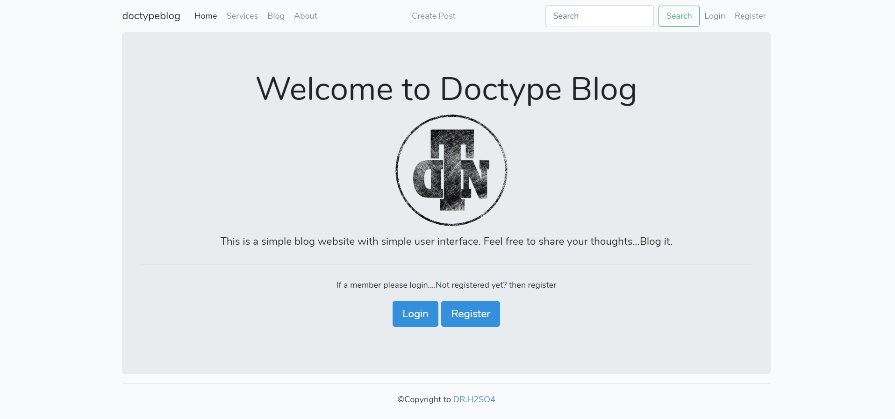
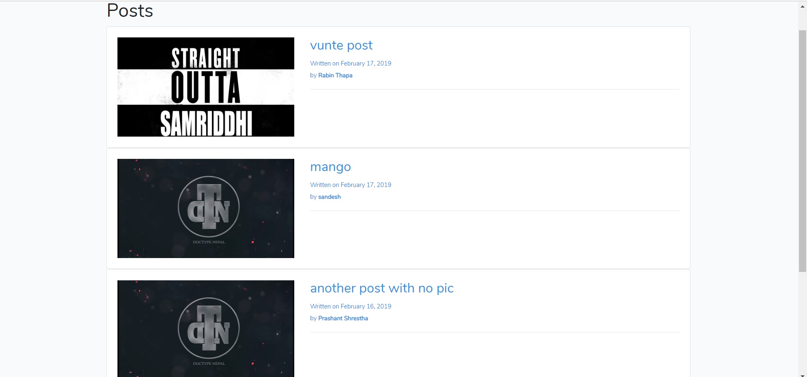
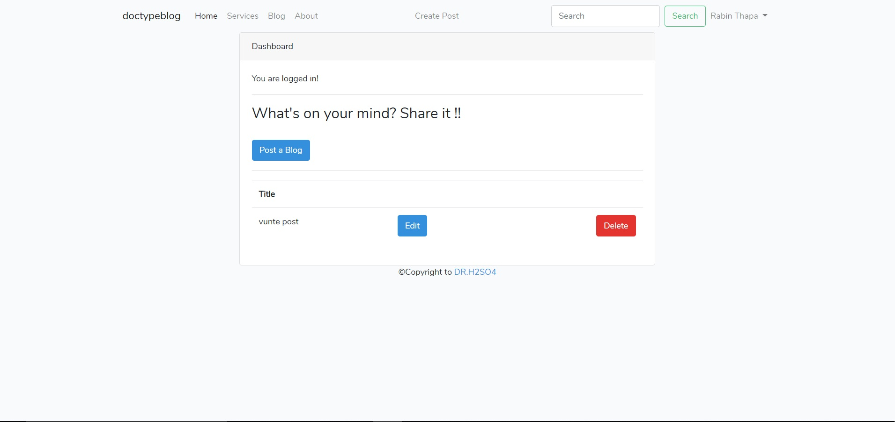
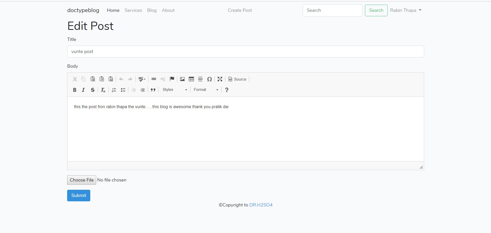

# Doctype Blog
### LaravelSimpleBlog
simple laravel blog CURD application
Rename .env.example file to .envinside your project root and fill the database information. (windows wont let you do it, so you have to open your console cd your project root directory and run mv .env.example .env )
Open the console and cd your project root directory
Run composer install or php composer.phar install
Run php artisan key:generate
Run php artisan migrate
Run php artisan db:seed to run seeders, if any.
Run php artisan serve
#####You can now access your project at localhost:8000 :)
>Export SQL file located in _SQL folder and name the database doctypeblog...and you are good to go.. 

